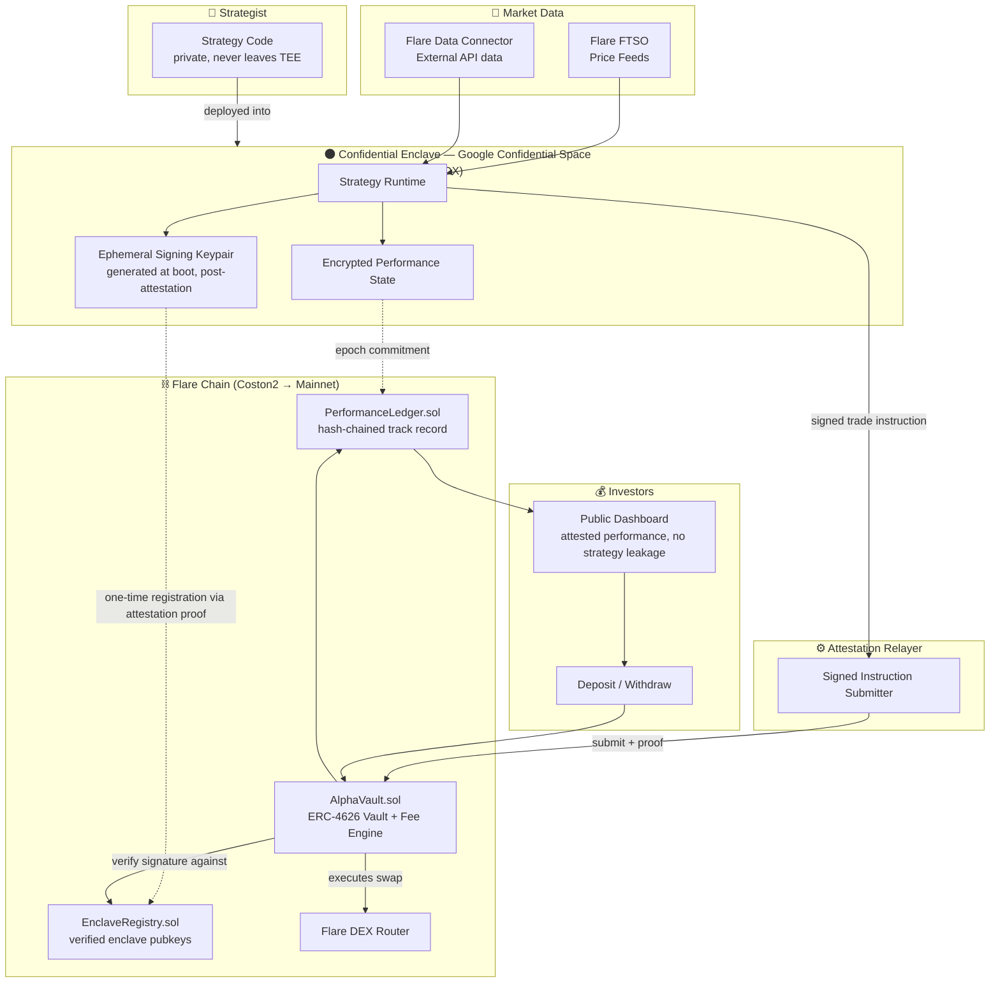
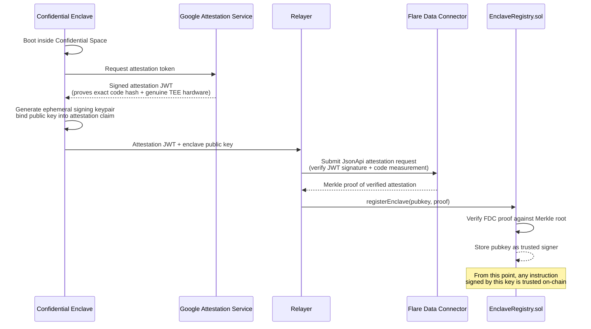
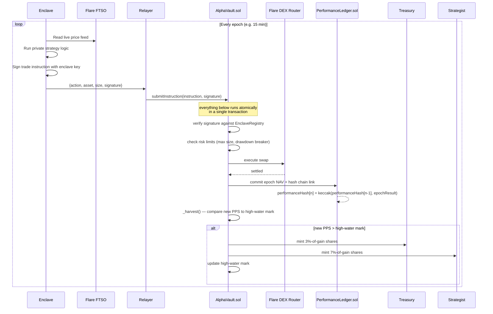
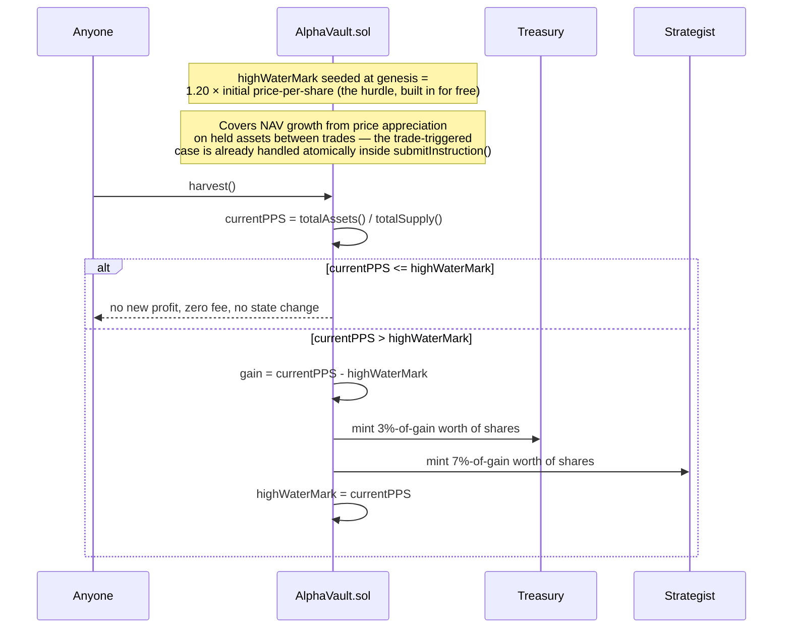
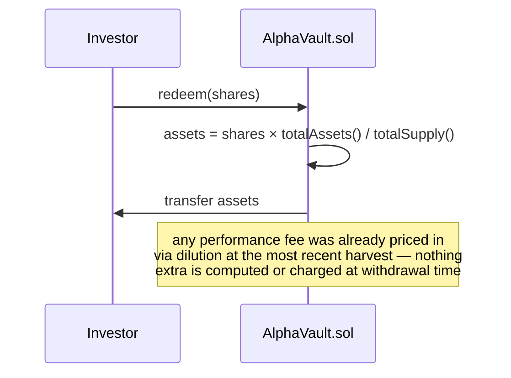
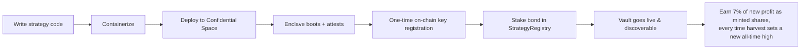
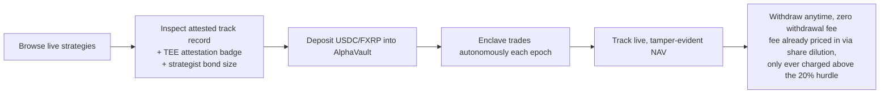

# 🌑 Eclipse Protocol

### Verifiable Alpha. Invisible Strategy.

**A confidential-compute asset management protocol on Flare — where trading strategies stay hidden inside a TEE, but every trade and every dollar of performance is cryptographically verifiable on-chain.**

Built for **Flare Summer Signal Hackathon — Bounty 2: Confidential Compute Apps**

---

## Table of Contents

- [🌑 Eclipse Protocol](#-eclipse-protocol)
    - [Verifiable Alpha. Invisible Strategy.](#verifiable-alpha-invisible-strategy)
  - [Table of Contents](#table-of-contents)
  - [Why "Eclipse"](#why-eclipse)
  - [The Problem](#the-problem)
  - [The Solution](#the-solution)
  - [Why This Needs a TEE (Not Just a Smart Contract)](#why-this-needs-a-tee-not-just-a-smart-contract)
  - [Architecture](#architecture)
    - [System Overview](#system-overview)
    - [Trust Bootstrap — One-Time Enclave Attestation](#trust-bootstrap--one-time-enclave-attestation)
    - [Live Trading Loop](#live-trading-loop)
    - [Standalone Harvest (Permissionless Fallback for Passive NAV Drift)](#standalone-harvest-permissionless-fallback-for-passive-nav-drift)
    - [Withdrawal Flow (Standard ERC-4626, No Fee Logic Here)](#withdrawal-flow-standard-erc-4626-no-fee-logic-here)
  - [Trust Model](#trust-model)
  - [Fee Model \& NAV Accounting](#fee-model--nav-accounting)
  - [Smart Contract Architecture](#smart-contract-architecture)
  - [Project Structure (Foundry)](#project-structure-foundry)
  - [User Flows](#user-flows)
    - [Strategist Flow](#strategist-flow)
    - [Investor Flow](#investor-flow)
  - [Tech Stack](#tech-stack)
  - [Flare Bounty Alignment](#flare-bounty-alignment)
  - [What's Newly Built for This Hackathon](#whats-newly-built-for-this-hackathon)
  - [Roadmap Beyond the Hackathon](#roadmap-beyond-the-hackathon)

---

## Why "Eclipse"

An eclipse hides the light source but the effect it casts — the shadow, the corona, the measurable event — is undeniable and observable by anyone on Earth.

That's the whole protocol in one image: **the strategy (the light source) is hidden inside the enclave. The alpha it generates (the signal) is fully public, attested, and verifiable.** Nobody has to trust the trader's word — they can verify the eclipse happened, down to the second, without ever seeing the sun.

---

## The Problem

Two groups in crypto trading have been talking past each other for years:

**Quant traders and strategists** have real, profitable edge — but won't share the logic, signals, or model weights that generate it. The moment a strategy is published or copy-traded in the open, it gets front-run, reverse-engineered, or arbitraged away within days. So the best strategies stay private, off-chain, and largely inaccessible to outside capital.

**Investors and allocators** want access to that edge, but every on-chain "copy trading" or "signal" platform today asks for blind trust: _"deposit your money, trust our black box."_ There is no way to verify that a strategy's historical track record is real, that trades weren't cherry-picked after the fact, or that the same signals aren't being front-run by the platform operator itself.

The result is a structural standoff: **real alpha stays private and inaccessible to capital; accessible strategies are rarely the real alpha.**

---

## The Solution

Eclipse Protocol lets a strategist deploy their trading logic **entirely inside a hardware-attested Trusted Execution Environment**. The enclave:

- Ingests market data and strategy state
- Runs the proprietary logic — signals, model, indicators, whatever it is — in complete isolation
- Emits **only** a signed trade instruction (direction, size, asset pair) — never the logic that produced it
- Maintains a running, tamper-evident performance ledger

Every trade instruction is cryptographically signed by a key that only exists inside an attested enclave. Flare smart contracts verify that signature before executing anything, and an on-chain performance ledger accumulates a permanent, auditable track record — hash-chained so it cannot be edited retroactively.

**Investors get a Numerai-style guarantee**: they can mathematically verify the strategy ran inside genuine, unmodified, isolated hardware, and that the performance history is real and untampered — without the strategist ever revealing a single line of code or a single signal.

**Strategists get what they've never had on-chain**: access to permissionless capital without giving up their edge, and a fee structure that only pays out when they actually deliver.

---

## Why This Needs a TEE (Not Just a Smart Contract)

| Requirement                                                      | Why a smart contract alone can't do it                                                    | What the TEE provides                                                                                              |
| ---------------------------------------------------------------- | ----------------------------------------------------------------------------------------- | ------------------------------------------------------------------------------------------------------------------ |
| Strategy logic must stay private                                 | All EVM state and calldata is public                                                      | Enclave memory is encrypted and isolated from the host, hypervisor, and even Flare validators                      |
| Strategy must still act autonomously on live market data         | On-chain compute is expensive and public; strategies would leak via gas traces / calldata | Enclave runs off-chain compute at full speed, privately, then emits only the final decision                        |
| Investors need to trust the output without trusting the operator | A centralized backend claiming "trust me" is exactly the failure mode we're replacing     | Remote attestation cryptographically proves the exact code that ran, before any output is trusted                  |
| Track record must be provably untampered                         | A database can be edited after the fact                                                   | Enclave-signed, hash-chained performance ledger — any retroactive edit breaks the chain and is publicly detectable |

---

## Architecture

### System Overview



### Trust Bootstrap — One-Time Enclave Attestation



### Live Trading Loop



`harvest()` is also exposed as a standalone, permissionless, idempotent public function (a no-op if price-per-share hasn't exceeded the high-water mark) — this covers NAV drift from passive price appreciation on held assets between trades, using the exact same internal fee logic as the atomic path above. Keeping the fee check embedded inside `submitInstruction()` specifically closes the window where someone could front-run a pending fee mint by withdrawing right after a NAV update but before the fee is settled.

### Standalone Harvest (Permissionless Fallback for Passive NAV Drift)



### Withdrawal Flow (Standard ERC-4626, No Fee Logic Here)



---

## Trust Model

**Trusted:**

- Google Confidential Space's hardware attestation (AMD SEV-SNP / Intel TDX) — the same primitive used by Flare's own `flare-ai-kit` SDK
- Flare's FDC consensus (50%+ signature weight) for bringing the attestation proof on-chain
- Standard EVM contract security assumptions on Flare

**Not trusted / explicitly out of scope for MVP:**

- The relayer is not trusted with funds — it only forwards signed messages; a malicious relayer cannot forge instructions because it doesn't hold the enclave's signing key, and the vault contract independently verifies signatures
- Side-channel attacks against the TEE hardware itself are a known, disclosed limitation of any TEE-based system (industry-wide, not specific to this protocol)
- Strategist bonding/staking provides an economic backstop: strategists post collateral that's slashed on detected malicious behavior (e.g. registering a new unattested key)

---

## Fee Model & NAV Accounting

Eclipse charges **one fee, and only one fee**: a performance fee on new profit, above a hurdle, tracked via a single global high-water mark. Nothing else.

| Fee type            | Rate                                            | Notes                                                                                              |
| ------------------- | ----------------------------------------------- | -------------------------------------------------------------------------------------------------- |
| Management fee      | **0%**                                          | Never charged on assets under management                                                           |
| Listing fee         | **0%**                                          | Free for strategists to deploy a vault                                                             |
| Withdrawal fee      | **0%**                                          | No penalty or friction on redeeming at any time                                                    |
| Performance fee     | **10% of new profit above the high-water mark** | Effectively gated behind a 20% hurdle (see below), charged at every `harvest()`, not at withdrawal |
| — split: Treasury   | 3% of gross profit                              | Minted as vault shares to the treasury address                                                     |
| — split: Strategist | 7% of gross profit                              | Minted as vault shares to the strategist's payout address                                          |
| Fee on losses       | **0%**                                          | Never charged — the fee only triggers when price-per-share sets a new all-time high                |

**How it's tracked, in plain terms — adapted from the standard "global price-per-share high-water mark" pattern used by mature vault protocols:**

- **One NAV, one high-water mark — not tracked per depositor.** The vault's price-per-share (`totalAssets() / totalSupply()`) is the single source of truth. Because ERC-4626 shares already price in the vault's current NAV at the moment of deposit, a depositor who joins after a gain automatically buys in at the higher price — they can never be charged a fee on profit that happened before they arrived. No per-user cost-basis bookkeeping needed.
- **The 20% hurdle is built into the starting point, not a separate rule.** The high-water mark is seeded at vault genesis to **1.20× the initial price-per-share**, instead of 1.00×. Practically: no fee can trigger until the vault's price-per-share has grown more than 20% from inception. Once that's cleared for the first time, the mechanism behaves exactly like a standard high-water mark from then on — the hurdle only ever matters once.
- **Fee triggers at `harvest()`, not at withdrawal.** Any address can call `harvest()` (typically the relayer, right after the enclave's trade settles). If the new price-per-share exceeds the high-water mark, the fee is calculated on that new gain and immediately minted as shares — no need to wait for an investor to withdraw for the protocol or strategist to realize their cut.
- **Paid as minted shares, not cash pulled from the vault.** The fee is never a token transfer out of vault reserves — it's new shares minted to the treasury and strategist, diluting all existing holders proportionally. This is deliberate: it means fee collection never reduces the vault's tradeable liquidity, and the treasury/strategist's payout is itself exposed to the vault's future performance (they hold shares, not cash, until they choose to redeem).
- **High-water mark only ever moves up.** If the vault dips after a gain and later recovers to the same peak, no fee is charged on that recovery — only genuinely new all-time-high profit is fee-eligible.

This is intentionally more conservative than most on-chain vaults and most traditional funds (2/20 is the industry-standard hedge fund model) — it's a deliberate positioning choice: **free to use, fee only on real, new profit, capped at 10%, gated behind a 20% hurdle before the protocol earns anything at all.**

---

## Smart Contract Architecture

MVP scope, designed for Foundry, deployed to **Coston2 (Flare testnet)**, built on **OpenZeppelin** primitives wherever possible rather than reinventing standard logic.

**Core contracts**

- **`AlphaVault.sol`** — the heart of the protocol. An ERC-4626-based vault (OpenZeppelin `ERC4626` as the base) that handles deposits/withdrawals, mints/burns shares, verifies incoming trade instructions against the registered enclave signer, enforces risk limits (max position size, drawdown circuit breaker via OpenZeppelin `Pausable`), executes swaps through the DEX router interface, and exposes a `harvest()` function that checks price-per-share against a single global high-water mark (seeded at 1.20× genesis PPS to encode the 20% hurdle) and mints the 10%-fee / 3-7 split as new shares to treasury and strategist when a new high is set.

- **`EnclaveRegistry.sol`** — the on-chain root of trust. Stores the mapping of attested enclave public keys to strategy/vault IDs. Exposes a one-time `registerEnclave()` function gated on a valid Flare Data Connector attestation proof, and a `isValidSigner()` view function the vault calls on every trade instruction. Uses OpenZeppelin `ECDSA` and `EIP712` for structured, replay-safe signature verification of enclave-signed instructions.

- **`PerformanceLedger.sol`** — an append-only, hash-chained record of every epoch's NAV commitment (`keccak256(previousHash, epochData)`), so historical performance can never be silently altered. Kept as a separate contract from `AlphaVault` so the audit trail persists independently of vault upgrades or migrations.

- **`StrategyRegistry.sol`** — strategist-facing registry: strategy metadata (name, asset pair, risk parameters), strategist bond/stake (using a standard `ERC20` stake token, slashable on detected misbehavior), and vault discovery data consumed by the frontend marketplace. Since listing is free, this contract's main job is bookkeeping and slashing conditions, not fee collection.

**Libraries**

- **`FeeMath.sol`** — pure, stateless library isolating the price-per-share / high-water-mark comparison and the 10%-fee / 3-7 split math, so it's independently unit-testable (dozens of profit/loss/harvest-sequence scenarios) without touching vault state, and reusable if a second vault type is added later. Because the high-water mark is now a single global value rather than per-depositor state, this library is simpler than a typical cost-basis tracker — no per-address storage, just a comparison and a split calculation.

**Interfaces**

- **`IAlphaVault.sol`**, **`IEnclaveRegistry.sol`** — standard interface separation so the frontend/relayer and any future integrating protocol can interact against a stable ABI rather than the implementation directly.
- **`IDexRouter.sol`** — thin interface over the Flare DEX router being used for execution (Uniswap-V2-style `swapExactTokensForTokens` shape), keeping the vault decoupled from any one router implementation.
- **`IFtsoV2.sol`** — interface over Flare's FTSOv2 price feed contracts, used for NAV valuation in a common unit (e.g. USD) across whatever assets the vault holds.
- **`IFdcVerification.sol`** — interface over Flare's Data Connector verification contracts, used specifically for the one-time enclave attestation proof check inside `EnclaveRegistry`.

**Mocks (test-only)**

- **`MockDexRouter.sol`**, **`MockFtsoV2.sol`**, **`MockFdcVerification.sol`**, **`MockEnclaveSigner.sol`** — deterministic stand-ins so the Foundry test suite can simulate multi-epoch NAV paths (including profitable and unprofitable runs) and assert the fee engine behaves correctly, independent of live testnet conditions.

**External libraries used**

- **OpenZeppelin Contracts** — `ERC4626`, `ERC20`, `AccessControl`/`Ownable2Step`, `ReentrancyGuard`, `Pausable`, `ECDSA`, `EIP712`, `SafeERC20`
- **Flare periphery contracts** — official Flare interfaces/libraries for FTSOv2 and FDC integration
- **forge-std** — Foundry's standard testing library

---

## Project Structure (Foundry)

```
eclipse-protocol/
├── contracts/
│   ├── foundry.toml
│   ├── remappings.txt
│   ├── src/
│   │   ├── core/
│   │   │   ├── AlphaVault.sol
│   │   │   ├── EnclaveRegistry.sol
│   │   │   ├── PerformanceLedger.sol
│   │   │   └── StrategyRegistry.sol
│   │   ├── libraries/
│   │   │   └── FeeMath.sol
│   │   ├── interfaces/
│   │   │   ├── IAlphaVault.sol
│   │   │   ├── IEnclaveRegistry.sol
│   │   │   ├── IDexRouter.sol
│   │   │   ├── IFtsoV2.sol
│   │   │   └── IFdcVerification.sol
│   │   └── mocks/
│   │       ├── MockDexRouter.sol
│   │       ├── MockFtsoV2.sol
│   │       ├── MockFdcVerification.sol
│   │       └── MockEnclaveSigner.sol
│   ├── script/
│   │   ├── DeployCoston2.s.sol
│   │   └── RegisterEnclave.s.sol
│   ├── test/
│   │   ├── unit/
│   │   │   ├── FeeMath.t.sol
│   │   │   └── EnclaveRegistry.t.sol
│   │   ├── AlphaVault.t.sol
│   │   └── integration/
│   │       └── FullFlow.t.sol
│   └── lib/                      # forge-std, OpenZeppelin, flare-periphery (git submodules)
├── enclave/
│   ├── src/                      # strategy runtime (TypeScript)
│   ├── attestation/               # RA-TLS bootstrap logic
│   └── Dockerfile
├── relayer/
│   └── src/
├── frontend/
│   ├── app/
│   └── components/
└── README.md
```

---

## User Flows

### Strategist Flow



### Investor Flow



---

## Tech Stack

| Layer                         | Technology                                                                                                                            |
| ----------------------------- | ------------------------------------------------------------------------------------------------------------------------------------- |
| Confidential compute          | Google Cloud Confidential Space (AMD SEV-SNP / Intel TDX), attestation via RA-TLS pattern                                             |
| Enclave runtime               | Node.js / TypeScript strategy runner, containerized (Docker)                                                                          |
| Smart contracts               | Solidity, Foundry, OpenZeppelin — `AlphaVault.sol` (ERC-4626), `EnclaveRegistry.sol`, `PerformanceLedger.sol`, `StrategyRegistry.sol` |
| Oracle / attestation bridging | Flare Data Connector (FDC) JsonApi attestation type, Flare FTSOv2 price feeds                                                         |
| Execution venue               | Flare-native DEX router (e.g. SparkDEX) for swap execution                                                                            |
| Relayer service               | Node.js/TypeScript, ethers.js/viem                                                                                                    |
| Frontend                      | React, Vite, TypeScript, Tailwind CSS, wagmi/viem                                                                                     |
| Network                       | Coston2 testnet → Flare mainnet                                                                                                       |

---

## Flare Bounty Alignment

| Judging Criterion              | How Eclipse Protocol Delivers                                                                                                                                                |
| ------------------------------ | ---------------------------------------------------------------------------------------------------------------------------------------------------------------------------- |
| **Product usefulness**         | Solves a real, named market failure — strategists won't share IP, investors won't trust black boxes — with a working vault and an investor-aligned fee model, not a toy demo |
| **Flare integration quality**  | Enclave attestation is anchored on-chain via FDC consensus; trade execution and performance data live entirely on Flare contracts; FTSOv2 feeds NAV valuation                |
| **Technical execution**        | Full-stack working demo: real enclave, real attested signing key, real on-chain vault executing real swaps and fee settlement on testnet, verifiable end-to-end              |
| **Evidence of new work**       | Entire protocol — enclave runtime, contracts, fee engine, relayer, frontend — built from zero during the hackathon window                                                    |
| **Clarity & future potential** | Clear path beyond hackathon: strategy marketplace, multi-chain execution (Solana vaults via Anchor), institutional onboarding, audited mainnet                               |

---

## What's Newly Built for This Hackathon

This is a brand-new protocol, not a port of an existing product — everything below is built during the hackathon window:

- `AlphaVault.sol` — ERC-4626 vault with signature-gated trade execution, risk limits, and a `harvest()`-triggered global high-water-mark performance fee engine
- `EnclaveRegistry.sol` — on-chain enclave attestation verification & key registration
- `PerformanceLedger.sol` — hash-chained, tamper-evident performance tracking
- `StrategyRegistry.sol` — strategist bonding, strategy discovery
- `FeeMath.sol` — price-per-share / high-water-mark comparison and 3-7 fee-split accounting library
- Confidential Space enclave runtime + attestation bootstrap flow
- Relayer service bridging enclave output to Flare via FDC
- Investor + strategist frontend dashboards

---


## Roadmap Beyond the Hackathon

- **Post-hackathon:** Security audit of vault + registry contracts, mainnet deployment
- **Q4 2026:** Strategy marketplace — multiple concurrent strategist vaults, investor-facing strategy discovery and comparison
- **2027:** Multi-chain execution vaults (Solana/Anchor execution alongside Flare EVM vaults), leveraging native Flare Confidential Compute (PMWs) once mainnet-live to reduce reliance on Google Confidential Space
- **Longer term:** Institutional-grade onboarding (compliance-gated vaults), strategist reputation scoring built on the attested track record history, infrastructure licensing for the attested-compute + on-chain-verification pattern beyond trading

---

_Built for Flare Summer Signal — Bounty 2: Confidential Compute Apps_
